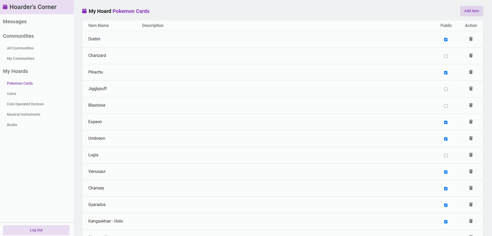
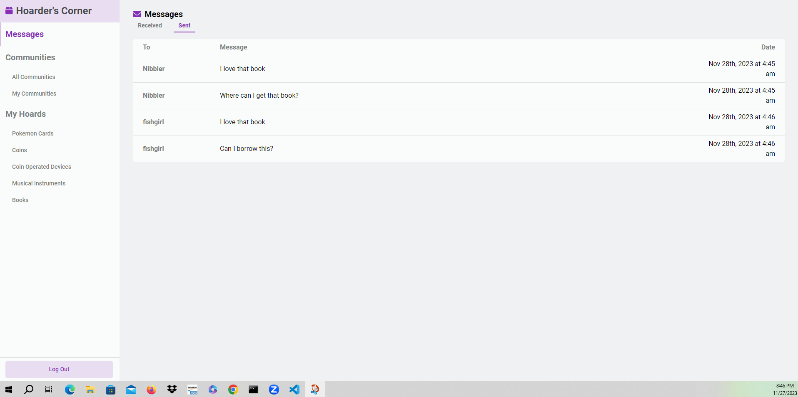

# Hoarder's Corner

## Description

Hoarder's Corner is an innovative platform designed to cater to the diverse interests of collectors. This application serves as a virtual showcase for users to display, discuss, and potentially trade their cherished possessions. It offers a diverse range of collections for users to explore and join, providing a unique opportunity to connect with like-minded individuals.

Within these groups, users can showcase items they wish to make public, fostering a sense of community and shared interest. This feature allows for interactive discussions about publicly displayed items, enhancing the overall user experience.

The platform is designed to be user-friendly and intuitive, making it accessible to even those who have never digitally tracked inventory before. Hoarder's Corner is more than just an application; it's a community for collectors. So, whether you're a seasoned collector or just starting your collection journey, Hoarder's Corner is the perfect place for you to explore and enjoy. Enjoy your collection journey!

## Table of Contents

- [Features](#features)
- [Installation](#installation)
- [Usage](#usage)
- [Contributing](#contributing)
- [License](#license)
- [Support](#support)
- [Assets](#assets)

## Features

All Communities | My Communities | My Hoards | Messaging

Hoarder's Corner uses the following packages:
-concurrently: For running multiple NPM scripts concurrenlty
-tailwindcss: For CSS frameworking for rapidly building custom designs

- apollo: For comprehsive state management that enables management of local and remote data with GraphQL
- bcrypt: For password hashing
- express: For web framework
- graphql: For querying for APIs
- jsonwebtoken: For authentication and information exchange
- mongoose: For managing relationships between data, providing schema validation and translating between objects in code and representing of those objects in Mongo DB
- react, react-dom, react-router-dom: For building user interfaces in single-page applications
- types: For helping catch errors in development
- eslint: For identifying and reporting on patterns found in code with the goal of making code more consistent and avoiding bugs
  -vitejs/plugin-react-swc: For compiling React code

## Installation

Deploy the live application via [Heroku Application](https://smell-o-scope-fing-longer-8a61e2b82a17.herokuapp.com/)

## Usage

On the front page of Hoarder's corner a user will see a list of communities and the option to log in or sign up

To view a list of all public items in a community, click on the community name.

To view a list of items in each of the user's communities click on the community on the left hand side under "My Hoards"

To view sent and received messages and reply to a sent message, click on "Messages" in the left hand column

## Contributing

Cloning the repo is welcome. Do not push new code into the repo without creating a pull requests.

## License

N/A

## Support

If you have any questions or problems with Hoarder's Corner, please create an issue on the GitHub repository: [Hoarder's Corner](https://github.com/jsgunn22/smell-o-scope)

## Assets

#### [Github Repository](https://github.com/jsgunn22/smell-o-scope) | [Render Deployed Application](https://hoarders-corner.onrender.com/)
